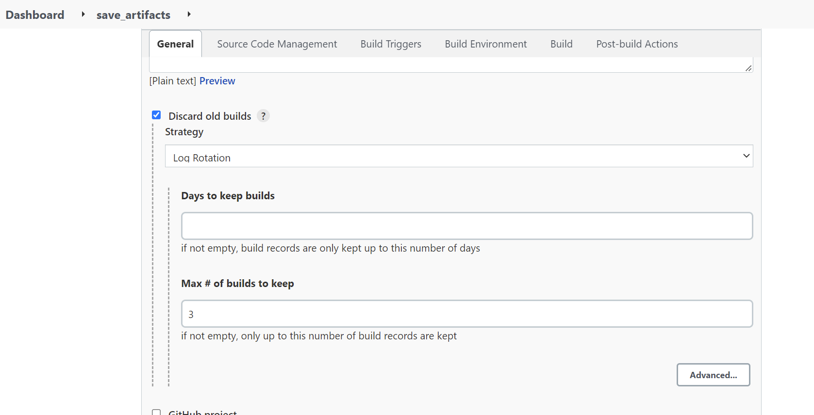

ANSIBLE REFACTORING AND STATIC ASSIGNMENTS

Create an "ansible-config-artifact" directory on jenkins-ansible sever used on project 11

`sudo mkdir /home/ubuntu/ansible-config-artifact`

Give jenkins user permissions to the folder

`sudo setfacl -m u:jenkins:rwx /home`

`sudo setfacl -m u:jenkins:rwx /home/ubuntu/ansible-config-artifact`

On Jenkins web console, install copy artifact plugin

Create and configure a new Freestyle project "save-artifacts" 

Test configuration by making a change in the ansible-config-mgt repo 

Check jenkins to confirm if build was successful

## Refactor Ansible code by importing other playbooks into site.yml

In ansible-config-mgt repository used in project 11

Create a new branch "refactor" on ansible-config-mgt repo

Create a file "sites.yml" within the playbooks folder

Create a new folder in root of the repository and name it static-assignments

Move common.yml file into static-assignments folder

In the previous project (project 11) wireshark was installed with commmon.yml playbook.

Create a new playbook common-del.yml under static-assignments add below code to delete wireshark from all servers

Update sites.yml file with import code

Edit ansible.cfg file to point inventory file to /home/ubuntu/ansible-config-artifact/inventory 

`sudo vi /etc/ansible/ansible.cfg`

Change directory to ansible-config-artifact

`cd /home/ubuntu/ansible-config-artifact`

Run ansible ping

`ansible all -m ping`

Run playbook

`ansible-playbook -i /home/ubuntu/ansible-config-artifact/inventory/dev.yml /home/ubuntu/ansible-config-artifact/playbooks/sites.yml`

Check servers to confirm wireshark was deleted

## CONFIGURE UAT WEBSERVERS WITH A ROLE ‘WEBSERVER’

Create 2 new red-hat EC2 instances to serve as UAT servers 

open http port in inbound rules

Create the below directory/files structure manually

Update inventory with UAT servers IP addresses

Edit /etc/ansible/ansible.cfg, change role path to /home/ubuntu/ansible-config-artifact/roles

`sudo vi /etc/ansible/ansible.cfg`

In task directory under webservers add the below code to main.yml playbook to:

1. Install and configure Apache
2. Clone Tooling website from GitHub https://github.com/ladifa1/tooling.git
3. Ensure the tooling website code is deployed to /var/www/html on each of 2 UAT Web servers
4. Make sure httpd service is started

In static-assignments folder, create a new assignment uat-webservers.yml

Since the entry point is the sites.yml file,  refer uat-webservers.yml role inside site.yml

Commit your changes, create a Pull Request and merge them to main branch

Check jenkins to confirm new build 

Run playbook against UAT inventory

`ansible-playbook -i /home/ubuntu/ansible-config-artifact/inventory/uat.yml /home/ubuntu/ansible-config-artifact/playbooks/site.yml`

Verfiy both UAT webservers are configured via browser.

Use public ip to access tooling site

